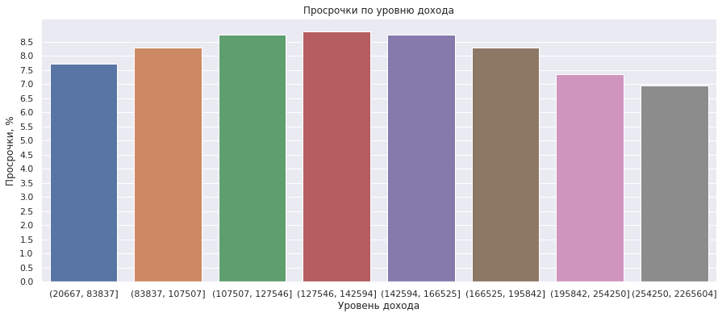

## Цели и задачи проекта

**Заказчик** — кредитный отдел банка. На основе статистики о платёжеспособности клиентов исследовать влияет ли семейное положение и количество детей клиента на факт возврата кредита в срок.

**Входные данные** - от банка — статистика о платёжеспособности клиентов в одном CSV-файле.

**Задачи:**
Выяснить:
1. Влияет ли количество детей на факт погашения кредита в срок?
2. Влияет ли семейное положение на факт погашения кредита в срок?
3. Влияет ли уровень дохода на факт погашения кредита в срок?
4. Как разные цели кредита влияют на его возврат в срок?

## Содержание проекта

1.  Цели и задачи проекта

2.  Загрузка и изучение данны

3.  Предобработка данны

  - 3.1  Удаление пропусков
  - 3.2  Обработка аномальных значений
  - 3.3  Удаление пропусков (продолжение)
  - 3.4  Изменение типов данных
  - 3.5  Обработка дубликатов
  - 3.6  Категоризация данных
  
4.  Исследование данных

  - 4.1  Есть ли зависимость между количеством детей и возвратом кредита в срок?
  - 4.2  Есть ли зависимость между семейным положением и возвратом кредита в срок?
  - 4.3  Есть ли зависимость между уровнем дохода и возвратом кредита в срок?
  - 4.4  Как разные цели кредита влияют на его возврат в срок?
  - 4.5  Возможные причины появления пропусков в исходных данных
  - 4.5.1  Почему заполнить пропуски медианным значением — лучшее решение для количественных переменных?
  
5.  Общий вывод

## Выводы

**Мы обработали полученные от банка данные - удалили пропуски, обработали аномальные значения, дубликаты.**

Для выделения зависимостей мы дополнительно категоризировали данные о доходах и целях кредитования.

**Категории уровня дохода в задании определены следующим образом:**

- 0–30000 — `'E'`;
- 30001–50000 — `'D'`;
- 50001–200000 — `'C'`;
- 200001–1000000 — `'B'`;
- 1000001 и выше — `'A'`.

**Мы обнаружили, что все категории имеют зависимость с выплатой кредита в срок в той или иной мере:**
1. Клиенты без детей самые надежные с точки зрения выплаты кредитов в срок.
2. Следует с осторожностью относиться к клиентам, которые не состоят или не состояли в зарегистрированном браке, - они чаще допускают просрочки по кредитам.
3. Клиенты с категорией дохода «E» (до 30 000) имеют больше всего просрочек.
4. Меньше всего просрочек допускается по кредитам на операции с недвижимостью, а самые рискованые кредиты на цели, связанные с автомобилями.

**Самыми ненадежными клиентами являются люди не бывавшие в браке, с доходом категори E, 1 ребенком, которые берут кредит на операции с автомобилем.**

**«Идеальный клиент» банка для получения кредита - это вдовец/вдова без детей, доходом выше категории «E», который берет кредит на операции с недвижимостью.**

**Рекомендации по улучшению качества данных:**
- указать информацию о доходе и трудовом стаже всех клиентов;

## Сведения

**Смотреть проект:** [1_predobrabotka.ipynb](1_predobrabotka.ipynb)

**Направления:** Data Analyst, Финансовый аналитик

**Сферы:** Банковская сфера, Кредитование

**Технологии:** Python, Pandas, Seaborn, NumPy

