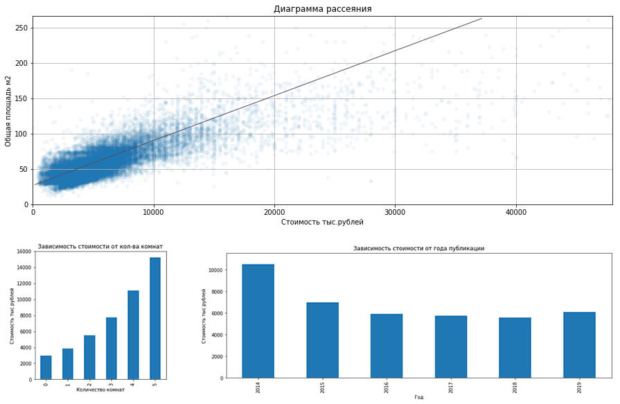
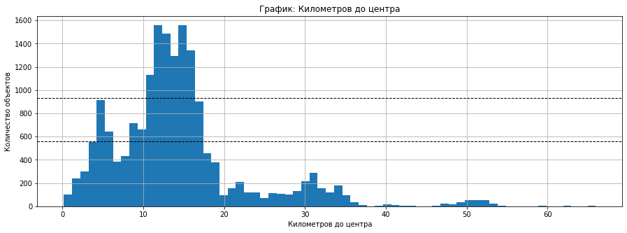

## Цели и задачи проекта

Используя данные сервиса Яндекс.Недвижимость — архив объявлений о продаже квартир в Санкт-Петербурге и соседних населённых пунктов за несколько лет — нужно установить параметры, чтобы научиться определять рыночную стоимость объектов недвижимости.

**Цель проекта** — провести исследование и определить параметры, влияющие на рыночную стоимость объектов недвижимости. 

**Задачи:**
1. Изучить параметры объектов;
2. Изучить, как быстро продавались квартиры;
3. Определить какие факторы больше всего влияют на общую (полную) стоимость объекта;
4. Выделить населённые пункты с самой высокой и низкой стоимостью квадратного метра.
5. Описать, как стоимость объектов зависит от расстояния до центра города. 

## Выводы

**Мы исследовали данные сервиса Яндекс.Недвижимость — архив объявлений о продаже квартир в Санкт-Петербурге и соседних населённых пунктах за несколько лет.**

По каждому объекту недвижимости было доступно два вида данных: вписанные пользователями (высота полотков и т.п.), и полученные автоматически на основе картографических данных (расстояние до центра, аэропорта и т.д.).

**Мы произвели предобработку данных, заполнили пропуски, избавились от неявных дубликатов в названиях локаций, обработали аномальные значения.**

Произвели исследовательский анализ данных, - общей площади, жилой площади, площади кухни, стоимости объектов, количества комнат, высоты потолков, этажа на котором расположен объект, типа этажа (первый, последний, другой), общего кол-ва этажей, расстояний до центра города, ближайшего парка, пруда и их кол-ва.

**Мы произвели анализ факторов, которые могут влиять на стоимость объекта недвижимости, и выявили следующее:**

1. В среднем объявление о продаже размещается в течение 180 дней. Быстрыми продажами можно называть срок до 1.5 месяцев, а необычайно долгими срок от 7,5 месяцев.
2. С 2014 года количество объявлений увеличивается, а среднее время публикации уменьшается (с 912 дней в 2014 до 31 дня в 2019).
3. Стоимость объектов линейно зависит (корр.77%) от общей площади помещения (в основном до 100 м.кв.).
4. Стоимость объектов линейно зависит (корр.66%) от жилой площади помещения.
5. Стоимость объектов зависит от площади кухни (корр.59%), в основном до 18-20м.кв.
6. Стоимость объектов линейно зависит от количества комнат, - с увеличением кол-ва комнат увеличивается и стоимость помещения.
7. Квартиры на первых этажах в среднем стоят дешевле всего, на последних дороже, но самые дорогие объекты недвижимости в основном располагаются не на 1 или последнем этаже.
8. Стоимость объектов недвижимости не имеет связи с днем или месяцев публикации объявления.
9. Наибольшая средняя стоимость недвижимости была в 2014 году; с 2015 (довольно стремительно) до 2019 (меньше) средняя стоимость падает; в 2019 году заметен небольшой рост средней стоимости объекта.

**Мы посчитали самый дорогой и дешевый квадратный метр недвижимости в ТОП-10 по количеству объявлений.** 
Самый дорогой средний квадратный метр - в Санкт-Петербурге - (112 080 рублей за м²). 
А самый дешевый средний квадратный метр - в Выборге - (58 141 рублей за м²).

**Мы выявили два основых параметра определения рыночной стоимости объектов недвижимости:**

**1.** На стоимость объекта сильно влияет размер общей площади и жилой площади. Чем больше площадь, - тем дороже. При площадях от 100 м² эта зависимость становится менее выраженной и начинют больше влияють другие параметры. 

**2.** Решающий фактор непосредственно влияющий на стоимость - расстояние до центра города. Самые дорогие объекты до 2-3 км от центра (превышают в 2-4 раза стоимость объектов далее 8-9 км от центра), второй по дороговизне ценовой сегмент расположен на расстоянии между 6 и 7 м от центра.

## Сведения

**Смотреть проект:** [issledovatelsky_analiz.ipynb](issledovatelsky_analiz.ipynb)

**Направления:** Data Analyst, Маркетинг-аналитик, Fraud-аналитик

**Сферы:** Интернет-сервисы, Площадки объявлений, Строительство

**Технологии:** Python, Pandas, Seaborn, Matplotlib, NumPy

