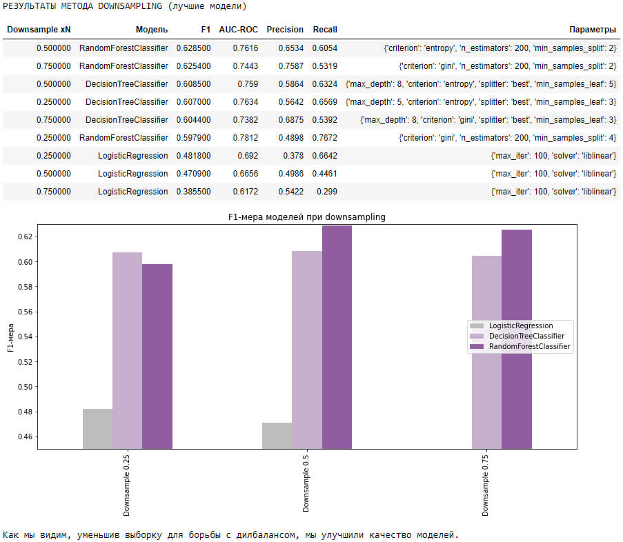

## Цели и задачи проекта

Каждый месяц, немного, но заметно из банка стали уходить клиенты. Банковские маркетологи посчитали: сохранить текущих клиенто дешевле, чем привлекать новых. Нам предоставлены исторические данные о поведении клиентов и расторжении договоров с банком.

**Цель проекта** — Построить модель с предельно большим значением F1-меры (не менее 0.59), которая сможет прогнозировать, уйдёт клиент из банка в ближайшее время или нет.

**Задачи:** 

1. Загрузить, изучить и обработать данные;
2. Исследовать баланс классов, обучить модель без учёта дисбаланса;
3. Улучшить качество модели, учитывая дисбаланс классов. Обучить разные модели и найти лучшую;
4. Провести финальное тестирование и определить лучшую модель;
5. Сделать вывод.

## Выводы

1. Мы загрузили, изучили и обработали данные, - Избавились от пропусков, преобразовали типы данных.

2. Мы исследовали поставленную задачу, изучили корреляцию признаков, класса (обнаружен дисбаланс).
- Подготовили данные к обучению моделей
- - Преобразовали категориальные признаки методом OHE
- - Масштабировали числовые признаки
- Построили три модели (`LogisticRegression`, `DecisionTreeClassifier` и `RandomForestClassifier`) перебирая гиперпараметры для наилучшего результата.
- - Лучший результат F1-меры показала модель RandomForestClassifier, немного превысив требуемую F1-меру 0.59

3. Мы приняли решение улучшить модели учитывая дисбаланс в классе
- Проверили метод увеличения выборки (`Upsampling`)
- - **Результат:** Лучшая модель RandomForestClassifier, при увеличении класса 1: 3.00, **F1: 0.6293**, AUC-ROC: 0.7527
- Проверили метод уменьшения выборки (`Downsampling`)
- - **Результат:** Лучшая модель: RandomForestClassifier, при уменьшении класса 0: 0.75, **F1: 0.6285**, AUC-ROC: 0.7616
- Проверили метод взвешивания классов (`class_weight='balanced'`)
- - **Результат:** Лучшая модель: RandomForestClassifier, F1: 0.613

4. **Выбрали лучшую модель:  RandomForestClassifier с `Upsampling` х3, метрика F1 0.6293 на valid выборке.**

5. Мы протестировали лучшую модель на тестовой выборке и получили **Результат: F1: 0.6104**, что соответствует поставленной задаче AUC-ROC: 0.7416, Precision: 0.6696, Recall: 0.5528
- Дополнительно мы успешно проверили выбранную модель на адекватность, сравнив с DummyClassifier.

**Вывод: Мы построили модель, предсказывающую уйдет ли клиент из банка, с показателем F1-меры 0.61**

## Сведения

**Смотреть проект:** [3_prognozirovanie_ottoka_klientov.ipynb](3_prognozirovanie_ottoka_klientov.ipynb)

**Направления:** Машинное обучение, Классификация

**Сферы:** Бизнес, Инвестиции, Банковская сфера, Кредитование

**Технологии:** Python, Pandas, Seaborn, Matplotlib, NumPy, Sklearn

**Приёмы и методы:** OneHotEncoder, StandardScaler, Upsampling, Downsampling, GridSearchCV, LogisticRegression, DecisionTreeClassifier, RandomForestClassifier, DummyClassifier, tqdm

*GridSearchCV был применен изначально, но потом от него отказались в пользу циклов, т.к. он долго работал.*
