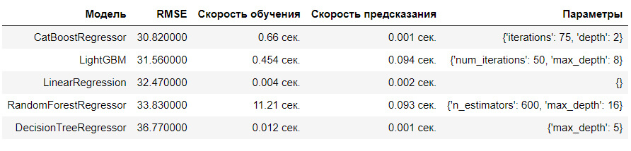

## Цели и задачи проекта

Чтобы привлекать больше водителей в период пиковой нагрузки, нужно спрогнозировать количество заказов такси на следующий час, используя исторические данные о заказах такси в аэропортах.

**Цель проекта:** Построить модель для предсказания количество заказов такси на следующий час.

**Условия задачи:** Значение метрики *RMSE* на тестовой выборке должно быть не больше 48.

## Выводы

1.  Мы загрузили, изучили и обработали данные, проверили дубликаты, пропуски, выбросы

2. Выполнили ресемплирование данных по одному часу, проверили монотонность индекса

3. Проанализировали данные: посмотрели на трендовую, сезонную и шумовую составляющие данных:

- тренд равномерного роста заказов с периодическими небольшими просадками
- сезонность по дням - спады заказов ночью, скачки роста утром, в обед и пик - вечером.

- добавили признаки и посмотрели на корреляцию

    
4. Подготовили и обучили модели
  

- Все модели показали RMSE меньше максимально допустимого (48).
- Самая большая ошибка у модели DecisionTreeRegressor
- Самая малая ошибка у модели CatBoostRegressor

    **Лучшая модель: CatBoostRegressor** Скорость обучения 3.864 сек., предсказания	0.001 сек.
    
5. Проверили данные на тестовой выборке (10%) и сделали выводы.

**Модель CatBoostRegressor показывает RMSE=47.31 (меньше максимально допустимиого 48) на тестовой выборке.** 
**Поставленные задачи выполнены.**

## Сведения

**Смотреть проект:** [4_prognoz_zakazov_taxi.ipynb](4_prognoz_zakazov_taxi.ipynb)

**Направления:** Машинное обучение, Временные ряды, Регрессия

**Сферы:** Бизнес, Интернет-сервисы, Стартапы

**Технологии:** Python, Pandas, Sklearn, Statsmodels, NumPy, Seaborn, Matplotlib

**Приёмы и методы:** seasonal_decompose, Ресемплирование, LinearRegression, RandomForestRegressor, DecisionTreeRegressor, LightGBM, CatBoostRegressor, tqdm
