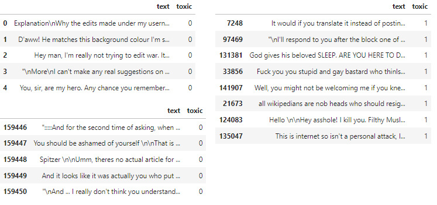
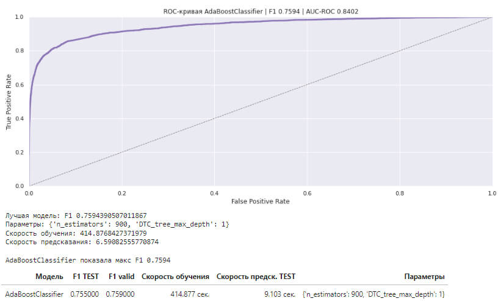

## Цели и задачи проекта

**Цель проекта:** Интернет-магазину нужен инструмент, который будет искать токсичные комментарии и отправлять их на модерацию. 

**Задача:** Построить модель классификации комментариев на позитивные и негативные со значением метрики качества *F1* не меньше 0.75.

## Выводы

1. Мы загрузили, изучили и обработали данные

  

2. Подготовили данные для обучения

    2.1. Обработали данные: почистили текст от лишних символов, переносов строк; токенизировали, лемматизировали и удалили стоп-слова
        
    2.2. Подготовили датасеты для построения моделей и закодировали посредством TF-IDF
    

3. Построили разные модели и протестировали на валидационной выборке:

    - Сделали сводную таблицу результатов обучения моделей
    
    - Оценили качество моделей и выбрали лучшую:

    3.1  DecisionTreeClassifier - показала макс F1 0.7157, результат не соответствует мин. F1 >=0.75
    
    3.2  AdaBoostClassifier (лучшая) - смогла показать результат F1=0.759 (>0.75) *долго обучается, но это не противоречит условиям задачи*
    
    3.3  LogisticRegression - смогла показать результат F1=0.755 (>0.75) *в случае, если скорость обучения важна - лучше выбрать её*
    
    3.4  RandomForestClassifier - показала макс F1=0.606, результат не соответствует мин. F1 >=0.75
    
    3.5. Определили лучшую модель
        - AdaBoostClassifier: F1 (valid) = 0.759 Скорость обучения	414.88 сек., предсказания	6.59 сек.
    
    
4. Проверили данные на тестовой выборке и сделали выводы.

   

   Модель AdaBoostClassifier показывает F1=0.755 (>0.75 по условиям задачи) на тестовой выборке.
   
   *Заметим, что эта модель обучается значительно дольше остальных, но немного лучше по F1-мере. Соответственно, если будет важна скорость обучения, то лучше выбрать LogisticRegression, которая также показала >0.75 на валидационной выборке.*

**Поставленные задачи выполнены.**

## Сведения

**Смотреть проект:** [comments_classification.ipynb](comments_classification.ipynb)

**Направления:** Машинное обучение, NLP, Классификация

**Сферы:** Интернет-сервисы, Стартапы, Мессенджеры, Службы поддержки пользователей

**Технологии:** Python, Pandas, Sklearn, WordNet, NLTK, TfidfVectorizer, NumPy, Seaborn, Matplotlib

**Приёмы и методы:** Токенизация, Лемматизация, StopWords, WordNet, Векторизация текста (TF-IDF), LogisticRegression, DecisionTreeClassifier, RandomForestClassifier, AdaBoostClassifier

