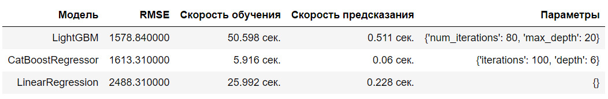

## Цели и задачи проекта

В нашем распоряжении исторические данные сервиса по продаже автомобилей с пробегом: технические характеристики, комплектации и цены.

**Цель проекта** — Предложить заказчику  прогнозирующую стоимость автомобилей модель, которую он сможет использовать в приложении для привлечения новых клиентов.

**Задачи:** Построить быструю и точную модель для определения стоимости автомобилей, со значением метрики RMSE не более 2500.

## Выводы

1. Мы загрузили,  изучили и обработали данные Избавились от дублей, лишних для модели признаков, обработали отсутствующие данные, аномальные и нулевые значения.

И провели анализ данных

    
2. Подготовили выборки для обучения моделей.
- отдельно обработали (кодировали OneHotEncoder категориальные и StandardScaler числовые) признаки для модели линейной регрессии
- обработали данные для моделей бустинга

3. Обучили разные модели, протестировав их и на валидационной выборке

4. Проанализировали время обучения, время предсказания и качество моделей.

- Опираясь на критерии заказчика (ему важна и скорость обучения!), выбрали лучшую модель:

    **Модель CatBoostRegressor с RMSE = 1613 на валидационной выборке.** Скорость обучения: 5.916 сек., предсказания: 0.06 сек.

5. Протестировали выбранную лучшую модель на тестовой выборке

    **На тестовой выборке лучшая модель CatBoostRegressor показала:**
    - Скорость предсказания: 0.09 сек.
    - RMSE: 1623.81

Все условия соблюдены, задача решена - решение найдено!

*Дополнительно, следует учесть, что скорость обучения и работы модели зависит в том числе и от технических характеристик устройства и от ПО, на котором всё запускается.*

## Сведения

**Смотреть проект:** [prognoz_ceny_avto.ipynb](prognoz_ceny_avto.ipynb)

**Направления:** Машинное обучение, Регрессия, Обработка данных

**Сферы:** Интернет-сервисы, Интернет-магазины, Бизнес

**Технологии:** Python, Pandas, Sklearn, Seaborn, Matplotlib

**Приёмы и методы:** OneHotEncoder, StandardScaler, LinearRegression, CatBoostRegressor, LightGBM

