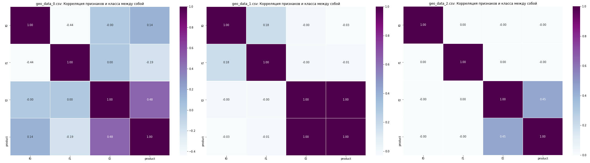
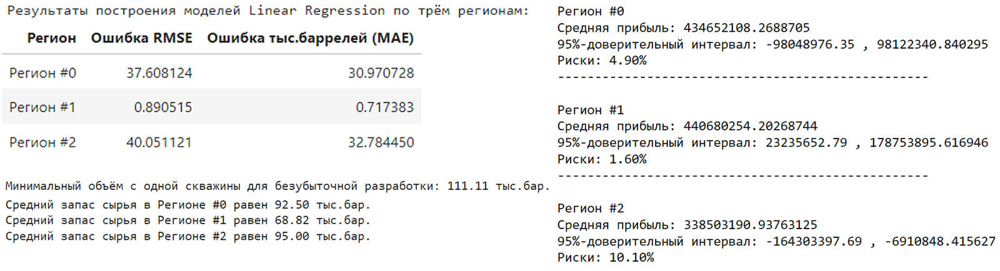

## Цели и задачи проекта

В добывающей нефть компании нужно решить, где бурить новую скважину. Нам предоставлены пробы нефти в трёх регионах: в каждом 10 000 месторождений, где измерили качество нефти и объём её запасов. 

**Задачи:**
- Построить модель машинного обучения, которая поможет определить регион, где добыча принесёт наибольшую прибыль.
- Проанализировать возможную прибыль и риски техникой `Bootstrap`.
- После оценки рисков нужно оставить лишь те регионы, в которых вероятность убытков меньше 2.5%. Среди них выбрать регион с наибольшей средней прибылью.

## Выводы

**1. Мы  загрузили и подготовили данные:**
- Во всех датасетах нет отсутствующих данных. Все признаки числовые.
- В признаках значения распределены нормально, в классе тоже.
- Обнаружили и обработали дубликаты по столбцу id (уник.идент.скважины).

**2. Подготовили данные, обучили и проверили модели по каждому региону:**

- Подготовились к обучению:
- - Проверили корреляцию признаков и класса (в двух датасетах (0.45 и 1.00) признак f2 коррелирует с классом);

- - Подготовили выборки по каждому региону (75/25%) для обучающей и валидационной;

- Обучили модели `LinearRegression`:
- - Ошибки RMSE по трём регионам: 37.6 / 0.90 / 40.0;

**3. Подготовились к расчету прибыли:**
- Проверили объемы добычи и определили:
- - Минимальный объём с одной скважины для безубыточной разработки: 111.11 тыс.бар.
- - Средний объем сырья ни в одном регионе не превышает минимальный, поэтому нужны лучшие скважины.
- Определили переменные в соответствии с условиями задачи, такими как:
- - Количество выбираемых скважин: 200 из 500;
- - Доход с одной скважины: 450 тыс.
- - Бюджет на всё: 10 млрд.
- Написали функции для:
- - Расчета прибыли по спрогнозированным значениям;
- - Перебора (`bootstrap`) 1000 вариаций выборок 500 скважин

**4. Рассчитали прибыль, риски, и выбрали регион:**

**5. Общий вывод:**

**Рекомендуем к разработе Регион 1, с показателями:** Средняя прибыль: 440.7 млн 95%-дов. интервал: 23.2 млн. - 178.8 млн. Риски: 1.6%

## Сведения

**Смотреть проект:** [prognoz_dobichi_nefti.ipynb](prognoz_dobichi_nefti.ipynb)

**Направления:** Машинное обучение, Регрессия, Разработка бизнес-модели, Финансовый аналитик

**Сферы:** Добывающие компании, Бизнес

**Технологии:** Python, Scikit-learn, Pandas, Seaborn, Matplotlib

**Приёмы и методы:** Bootstrap, MSE, RMSE, MAE, LinearRegression

