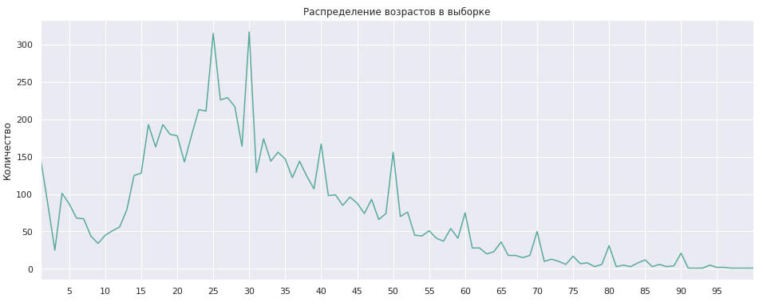
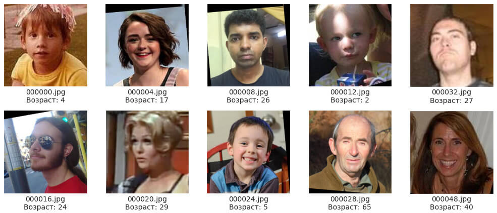
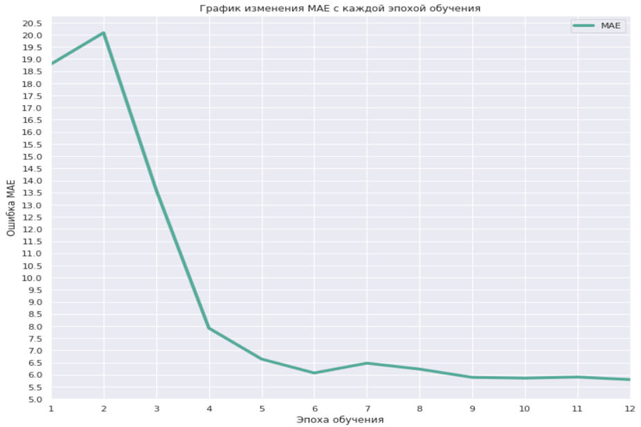

## Цели и задачи проекта

Супермаркету требуется решение для определения возвраста клиентов при помощи фотофиксации в прикассовой зоне супермаркета. В нашем распоряжении набор фотографий людей с указанием возраста.

**Цель проекта:** Предложить решение для определения возраста по фото для супермаркета.

**Задачи:** Построить модель, которая по фотографии определит приблизительный возраст человека.

**Дополнительная информация:**

1. Функцией потерь не обязательно должна быть MAE. Зачастую нейронные сети с функцией потерь MSE обучаются быстрее.
2. Значение метрики качества `MAE` на тестовой выборке должно быть не больше 8.
3. В [статье о датасете](http://people.ee.ethz.ch/~timofter/publications/Agustsson-FG-2017.pdf), с которым мы работаем, значение MAE равно 5.4 — если получим MAE меньше 7, это будет отличный результат!

## Выводы

1. Мы провели исследовательский анализ данных, построили график распределения возраста в выборке.

    

2. Обучили модель используя Yandex Compute Cloud (GPU)

3. Провели анализ модели

    3.1. Время обучения 12 эпох составило: 9 минут 12 секунд 
    Прогноз TEST занял: 10 секунд.
        
    3.2. MAE: 5.7973 на тестовой выборке.

4. Сделали выводы

**Решены задачи:**
- Построена модель со значением метрики качества *MAE* на тестовой выборке не больше 8.
- - **У нашей модели MAE 5.7973 на тестовой выборке.**

## Сведения

**Смотреть проект:** [CV_opredelenie_vozrasta.ipynb](CV_opredelenie_vozrasta.ipynb)

**Направления:** Машинное обучение, Компьютерное зрение, Обработка изображений

**Сферы:** Бизнес, Безопасность, Оффлайн

**Технологии:** Python, Keras, Pandas, Yandex Compute Cloud (GPU)

**Приёмы и методы:** ImageDataGenerator, flow_from_dataframe, ResNet50, GlobalAveragePooling2D, Adam

*Код обучения модели: [code.py](code.py)*

