## GPU: Модель поиска похожих изображений

На самом деле, это попытка решить задачу контеста "Стажировка весна-лето 2023 | ML".

**ЗАДАЧА: E. Звёздные карты 3.0**

**Ваша задача** - предложить 6 уникальных фотографий, наиболее похожих на каждый запрос.


**Формат ввода**<br/>
По ссылке вам доступен набор изображений. Каждое изображение однозначно определяется своим именем и является как запросом, так и возможной рекомендацией для любого другого запроса. Изображение не может быть рекомендацией для самого себя.

**Формат вывода**<br/>
Вам требуется сопоставить каждому изображению 6 наиболее похожих на него изображений из доступных.

**Пример submission.csv:**

filename,ranking<br/>
0001.png,0010.png 0011.png 0012.png 0013.png 0014.png 0015.png<br/>
0002.png,0010.png 0011.png 0012.png 0013.png 0014.png 0015.png<br/>
0003.png,0010.png 0011.png 0012.png 0013.png 0014.png 0015.png<br/>
...<br/>
9999.png,0010.png 0011.png 0012.png 0013.png 0014.png 0015.png

### Вывод:

**Требуемой точности на приватном тесте я не достиг,<br/>однако научился использовать GPU для решения задач машинного обучения.**

*Upd:1 Потому что без ГПУ - это вообще было почти невыполнимо, особенно с учетом ограничений по времени.*

*Upd:2 Да, я понимаю, что скорее всего задачу нужно было решать без TF через векторные расстояния.*

---

**Код ниже:**


```python
#!pip install tensorflow-directml-plugin
```


```python
import matplotlib.pyplot as plt
import numpy as np
import os
import random
import tensorflow as tf
from pathlib import Path
from tensorflow.keras import applications
from tensorflow.keras import layers
from tensorflow.keras import losses
from tensorflow.keras import optimizers
from tensorflow.keras import metrics
from tensorflow.keras import Model
from tensorflow.keras.applications import resnet
from tensorflow.keras.applications import vgg16

import time
from sklearn.decomposition import PCA
from os import walk
from tensorflow.keras.utils import load_img,img_to_array
from keras.applications.imagenet_utils import preprocess_input
from scipy.spatial import distance

from tqdm.notebook import tqdm

import codecs, json
import pandas as pd
```


```python
def load_image(path, target_size):
    img = load_img(path, target_size=target_size)
    x = img_to_array(img)
    x = np.expand_dims(x, axis=0)
    x = preprocess_input(x)
    return img, x

def get_images_paths(path):
    f = []
    for (dirpath, dirnames, filenames) in walk(path):
        f.extend(filenames)
        break
    f = [path+'/'+item for item in f]
    return f

def getfilename(ff):
    f = ff.split('/')
    return f[-1]
```


```python
def do_model(images_paths):
    
    print('DO: model...')
    model = vgg16.VGG16(weights='imagenet', include_top=True)
    
    print('DO: feat_extractor...')
    feat_extractor = Model(inputs=model.input, outputs=model.get_layer("fc2").output)
    feat_extractor.summary()
    
    print('DO: features...')
    features = []
    pbar = tqdm(total=len(images_paths))
    for i, image_path in enumerate(images_paths):
        img, x = load_image(image_path, model.input_shape[1:3]);
        feat = feat_extractor.predict(x,verbose = 0)[0]
        features.append(feat)
        pbar.update()
    pbar.close()
    
    features = np.array(features)

    print('DO: PCA...')
    pca = PCA(n_components=100)
    pca.fit(features)

    print('DO: pca_features...')
    pca_features = pca.transform(features)

    print('Done!')
    
    return model, pca_features
```


```python
tf.config.experimental.list_physical_devices()
```


    [PhysicalDevice(name='/physical_device:CPU:0', device_type='CPU'),
     PhysicalDevice(name='/physical_device:GPU:0', device_type='GPU')]


```python
path = 'D:/DS/dataset'

images_paths = get_images_paths(path)
print(len(images_paths))
print(images_paths[0])
```

    9605
    D:/DS/dataset/0000.png
    


```python
%%time
with tf.device('/GPU:0'):
    model, pca_features = do_model(images_paths)
```

    DO: model...
    DO: feat_extractor...
    Model: "model"
    _________________________________________________________________
     Layer (type)                Output Shape              Param #   
    =================================================================
     input_1 (InputLayer)        [(None, 224, 224, 3)]     0         
                                                                     
     block1_conv1 (Conv2D)       (None, 224, 224, 64)      1792      
                                                                     
     block1_conv2 (Conv2D)       (None, 224, 224, 64)      36928     
                                                                     
     block1_pool (MaxPooling2D)  (None, 112, 112, 64)      0         
                                                                     
     block2_conv1 (Conv2D)       (None, 112, 112, 128)     73856     
                                                                     
     block2_conv2 (Conv2D)       (None, 112, 112, 128)     147584    
                                                                     
     block2_pool (MaxPooling2D)  (None, 56, 56, 128)       0         
                                                                     
     block3_conv1 (Conv2D)       (None, 56, 56, 256)       295168    
                                                                     
     block3_conv2 (Conv2D)       (None, 56, 56, 256)       590080    
                                                                     
     block3_conv3 (Conv2D)       (None, 56, 56, 256)       590080    
                                                                     
     block3_pool (MaxPooling2D)  (None, 28, 28, 256)       0         
                                                                     
     block4_conv1 (Conv2D)       (None, 28, 28, 512)       1180160   
                                                                     
     block4_conv2 (Conv2D)       (None, 28, 28, 512)       2359808   
                                                                     
     block4_conv3 (Conv2D)       (None, 28, 28, 512)       2359808   
                                                                     
     block4_pool (MaxPooling2D)  (None, 14, 14, 512)       0         
                                                                     
     block5_conv1 (Conv2D)       (None, 14, 14, 512)       2359808   
                                                                     
     block5_conv2 (Conv2D)       (None, 14, 14, 512)       2359808   
                                                                     
     block5_conv3 (Conv2D)       (None, 14, 14, 512)       2359808   
                                                                     
     block5_pool (MaxPooling2D)  (None, 7, 7, 512)         0         
                                                                     
     flatten (Flatten)           (None, 25088)             0         
                                                                     
     fc1 (Dense)                 (None, 4096)              102764544 
                                                                     
     fc2 (Dense)                 (None, 4096)              16781312  
                                                                     
    =================================================================
    Total params: 134,260,544
    Trainable params: 134,260,544
    Non-trainable params: 0
    _________________________________________________________________
    DO: features...
    


      0%|          | 0/9605 [00:00<?, ?it/s]


    DO: PCA...
    DO: pca_features...
    Done!
    CPU times: total: 2min 14s
    Wall time: 2min 12s
    


```python
# SAVE!!!

filpath = 'YC_5_pca_features.json'
json.dump(pca_features.tolist(), codecs.open(filpath, 'w', encoding='utf-8'), 
          separators=(',', ':'), 
          sort_keys=True)
```

**--------------------------------**

Т.к. картинки обрабатываются долго, делаю экспорт в JSON, чтобы потом можно было использовать веса.

**--------------------------------**


```python
# LOAD!!!

filpath = 'YC_5_pca_features.json'
obj = codecs.open(filpath, 'r', encoding='utf-8').read()
features = json.loads(obj)
features = np.array(features)
print('OK!', len(features))
```

    OK! 9605
    


```python
result = 'submission.csv'
```

**Ищем похожие:**

и сохраняем в файл под формат задачи.


```python
%%time
with tf.device('/GPU:0'):
    open(result, 'w').close()
    with open(result, 'a') as fd:
        fd.write("filename,ranking\n")
    pbar = tqdm(total=len(features))
    for cur_idx in range(len(features)):

        similar_idx = [distance.cosine(features[cur_idx], feat) for feat in features]
        idx_closest = sorted(range(len(similar_idx)), key=lambda k: similar_idx[k])[1:7]

        fls = []
        for idx in idx_closest:
            fls.append(getfilename(images_paths[idx]))

        line = f'{getfilename(images_paths[cur_idx])},'+' '.join(fls)

        with open(result, 'a') as fd:
            fd.write(line+"\n")

        pbar.update()
    pbar.close()
    print('Done!')
```


      0%|          | 0/9605 [00:00<?, ?it/s]


    Done!
    CPU times: total: 6min 14s
    Wall time: 6min 12s
    


```python
pd.set_option('display.max_colwidth', None); pd.read_csv('submission.csv')
```


<div>
<table border="1" class="dataframe">
  <thead>
    <tr style="text-align: right;">
      <th></th>
      <th>filename</th>
      <th>ranking</th>
    </tr>
  </thead>
  <tbody>
    <tr>
      <th>0</th>
      <td>0000.png</td>
      <td>5486.png 8222.png 7076.png 7447.png 0157.png 2947.png</td>
    </tr>
    <tr>
      <th>1</th>
      <td>0001.png</td>
      <td>5193.png 3853.png 5029.png 2575.png 3598.png 3986.png</td>
    </tr>
    <tr>
      <th>2</th>
      <td>0002.png</td>
      <td>3977.png 7688.png 5492.png 1858.png 8914.png 4568.png</td>
    </tr>
    <tr>
      <th>3</th>
      <td>0003.png</td>
      <td>1803.png 1797.png 9238.png 6847.png 3333.png 1393.png</td>
    </tr>
    <tr>
      <th>4</th>
      <td>0004.png</td>
      <td>6371.png 2961.png 4593.png 9406.png 2462.png 2470.png</td>
    </tr>
    <tr>
      <th>...</th>
      <td>...</td>
      <td>...</td>
    </tr>
    <tr>
      <th>9600</th>
      <td>9600.png</td>
      <td>0095.png 2356.png 9452.png 2312.png 4522.png 7663.png</td>
    </tr>
    <tr>
      <th>9601</th>
      <td>9601.png</td>
      <td>4463.png 5171.png 9585.png 8995.png 7150.png 2322.png</td>
    </tr>
    <tr>
      <th>9602</th>
      <td>9602.png</td>
      <td>5715.png 5938.png 5991.png 4789.png 9189.png 8980.png</td>
    </tr>
    <tr>
      <th>9603</th>
      <td>9603.png</td>
      <td>8022.png 8816.png 1286.png 5323.png 7483.png 6401.png</td>
    </tr>
    <tr>
      <th>9604</th>
      <td>9604.png</td>
      <td>5065.png 3557.png 0976.png 8775.png 9011.png 5604.png</td>
    </tr>
  </tbody>
</table>
<p>9605 rows × 2 columns</p>
</div>


## Результаты (оригинал - похожие):


```python
for mid in range(10):
    image = mpimg.imread(path+'/'+submission.iloc[mid]['filename'])
    plt.imshow(image);

    fig = plt.figure(figsize=(12,10))
    i=0;
    for ipath in submission.iloc[mid]['ranking'].split(' '):
        fpath = path+'/'+ipath
        image = mpimg.imread(fpath)
        fig.add_subplot(1, 6, i+1)
        plt.imshow(image)
        plt.xticks([]); plt.yticks([]); plt.tight_layout(); i+=1
    plt.show(); print(); print('*'*50); print()
```


    
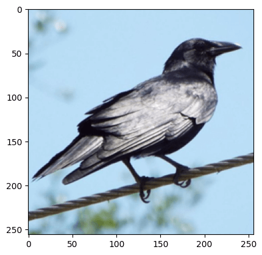
    


    
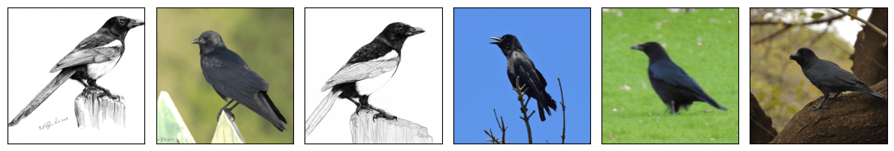
    


    
    **************************************************
    
    


    
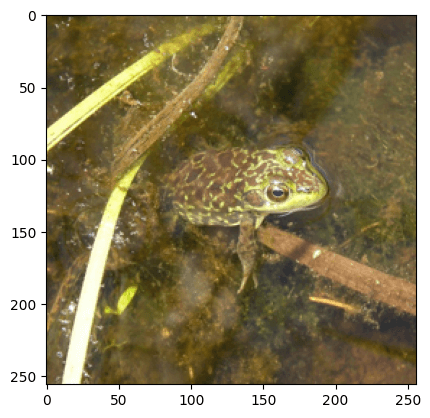
    


    

    


    
    **************************************************
    
    


    
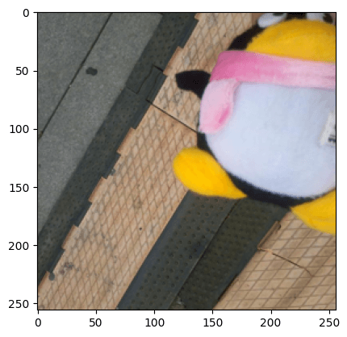
    


    
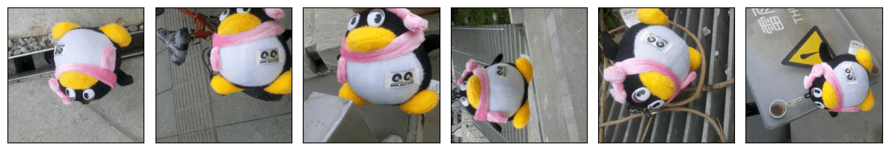
    


    
    **************************************************
    
    


    
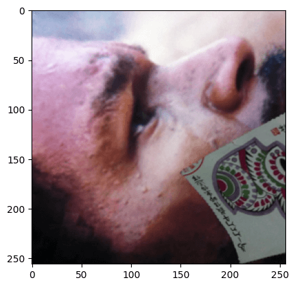
    


    
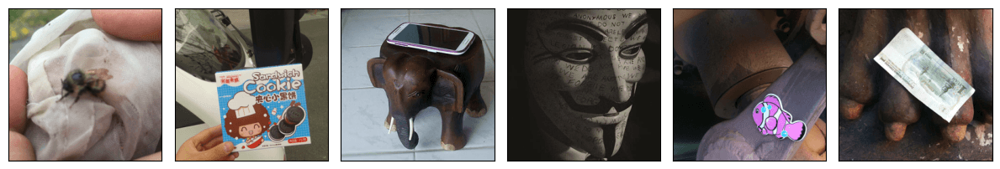
    


    
    **************************************************
    
    


    
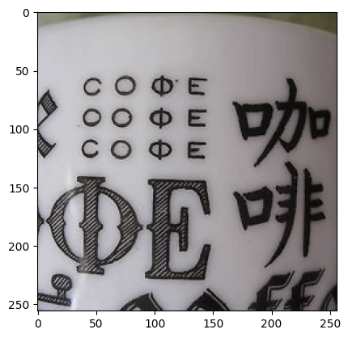
    


    
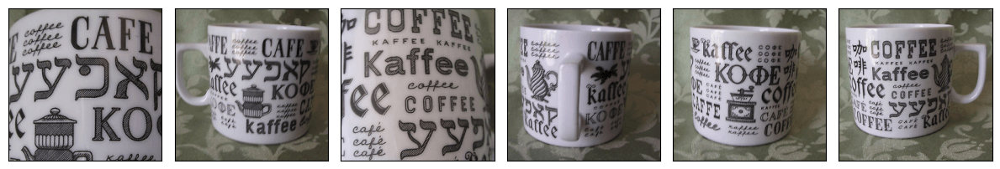
    


    
    **************************************************
    
    


    
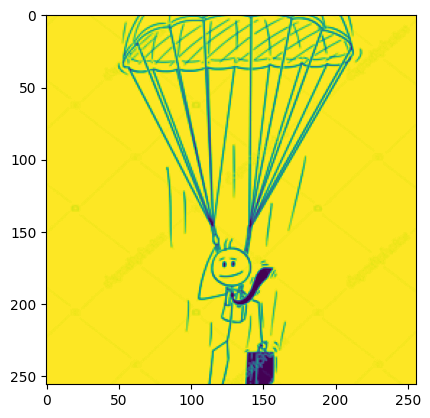
    


    
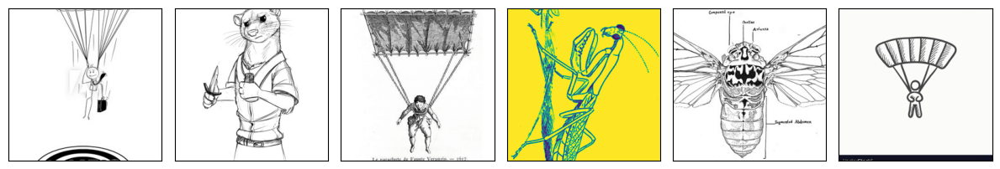
    


    
    **************************************************
    
    


    
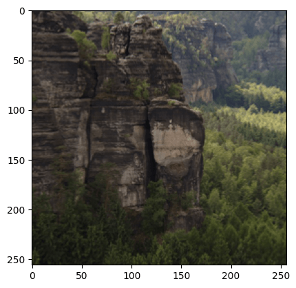
    


    
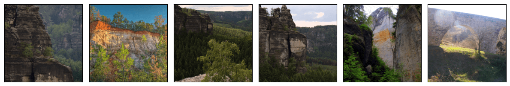
    


    
    **************************************************
    
    


    
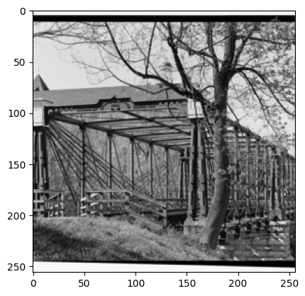
    


    
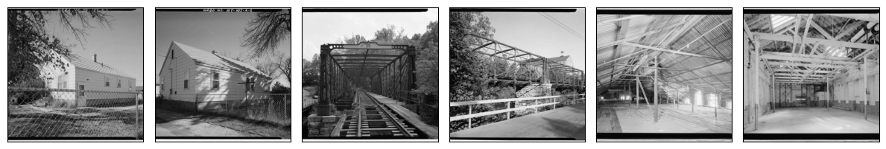
    


    
    **************************************************
    
    


    
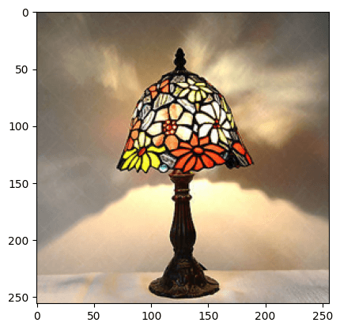
    


    
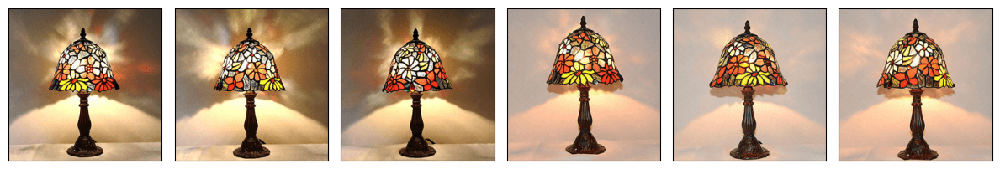
    


    
    **************************************************
    
    


    
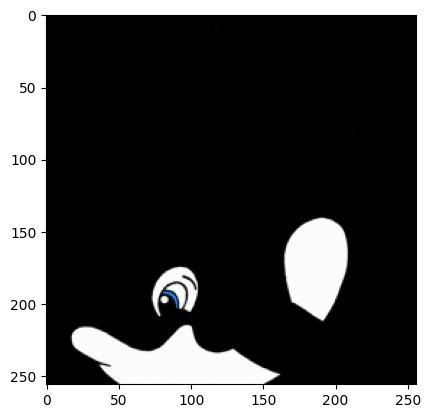
    


    

    


    
    **************************************************
    
    


```python

```
