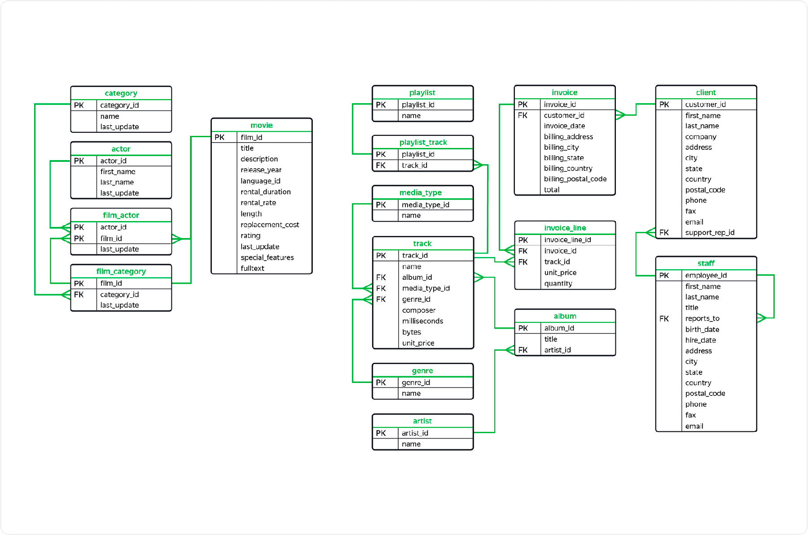
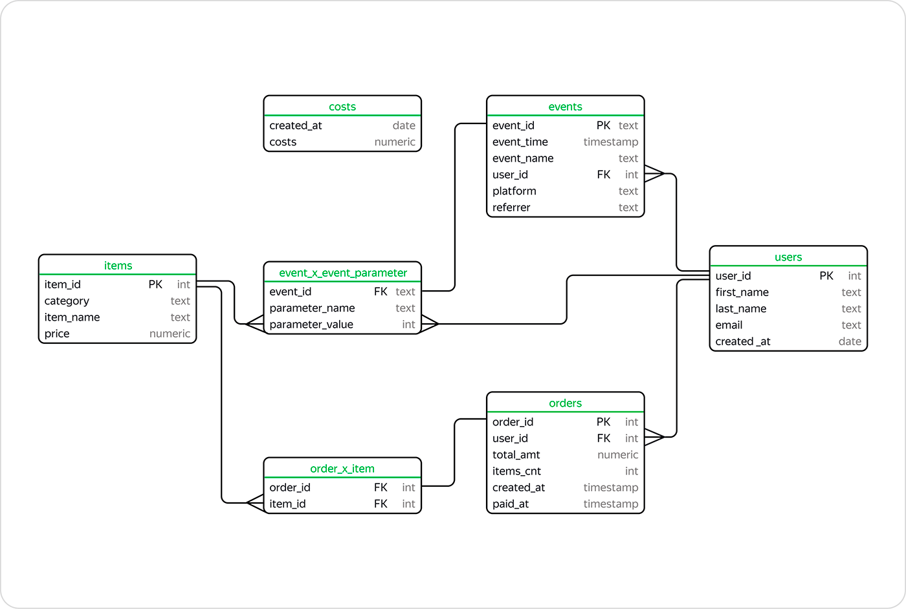
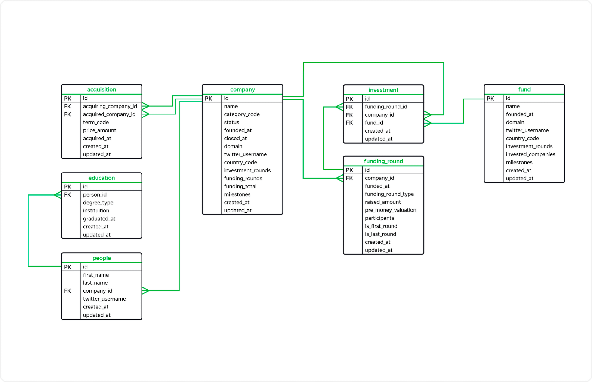

## Цели и задачи

Здесь находится подборка SQL кода, написанного мною в процессе выполнения практических задач SQL.

**Цель** — изучить базовый SQL и PySpark.

**Задачи:** выполнить практические задачи, сформулировать выводы.

## Выводы

**Выполнил задачи:**

Применил SQL на практике, успешно выполнив задачи получения данных из базы данных (PostgreSQL/MySQL), используя:
- срезы данных (select, case, where, extract, cast, in, like, between, order, limit, offset и т.д.);
- агрегирующие функции (count, sum, min, max, avg, having и т.д.);
- объединения таблиц (псевдонимы, ключи, inner/left/right/full join, union);
- подзапросы (в from, в where) и временные таблицы (with as);
- PySpark (rdd, dataframes, sql);
- оконные функции (over, partition by, row_number, rank, ntile, lead, lag, window и т.д.).

Дополнительно:
- попрактиковался в задачах создания БД, таблиц кодом,
- записи данных в базу с различными условиями;
- улучшил навыки работы с pgAdmin, phpMyAdmin.

<table width="100%" border=0 cellspacing=0 cellpadding=10>
  <tr>
    <td width="33%">Схема БД №1 </td>
    <td width="33%">Схема БД №2 </td>
    <td width="33%">Схема БД №3 </td>
  </tr>
</table>

## Сведения

**Смотреть:** [sql_tasks.md](sql_tasks.md)

**Направления:** Data Analyst, Data Engineer

**Сферы:** Банковская сфера, Интернет-сервисы, Big Data, Машинное обучение

**Технологии:** SQL, PySpark, pgAdmin, phpMyAdmin

