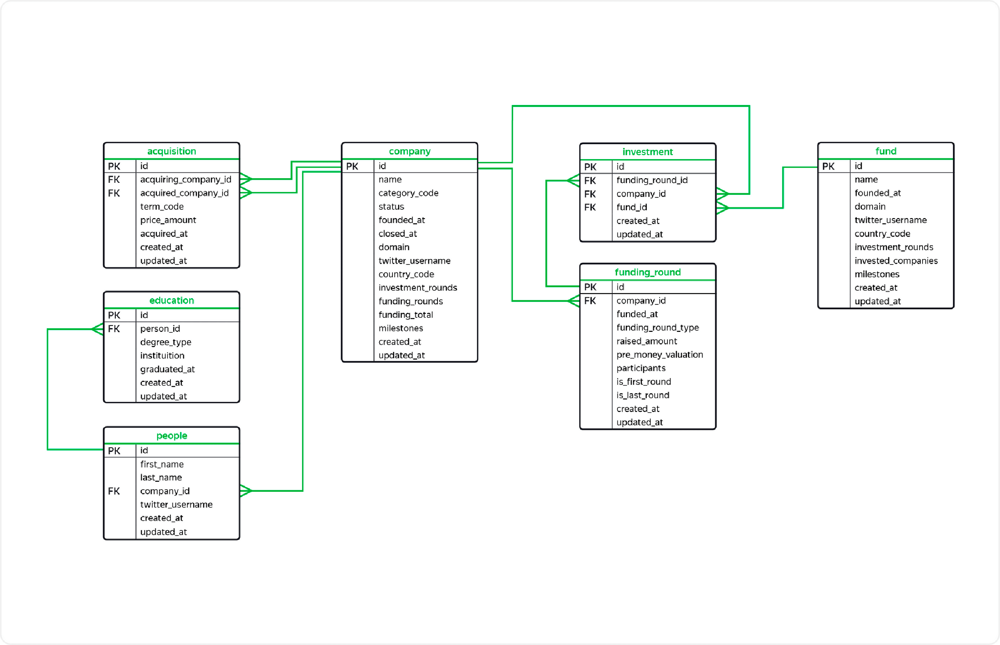

# Практические задачи по SQL

## Цели и задачи

Здесь находится подборка SQL кода, написанного мною в процессе выполнения некоторых практических задач SQL.

Код был проверен, поэтому результаты выполнения в этом файле не выводятся.

**Цель** — изучить базовый SQL и PySpark.

**Задачи:** выполнить практические задачи, сформулировать выводы.

**Содержание:**

1. Срезы данных SQL
2. Агрегирующие функции
3. Объединения таблиц
4. Подзапросы
5. Временные таблицы
6. PySpark
7. Оконные функции
8. Дополнительные задачи по SQL

<h2 id="Срезы-данных-SQL">Срезы данных SQL</h2>

БД №1


Выведите первые 20 записей из таблицы track. Оставьте в итоговой таблице только два поля: name и unit_price.
```
SELECT
    name,
    unit_price
FROM track
LIMIT 20
```

---

Выгрузите из таблицы track поля milliseconds и bytes. Оба поля должны быть строками. Используйте тип данных для строк нефиксированной длины.
```
SELECT 
    CAST(milliseconds AS character varying),
    CAST(bytes AS character varying)   
FROM track;
```

---

Из таблицы invoice выгрузите поле billing_address, оно хранит адрес выставления счёта, и поле invoice_date с датой покупки. Дата указана в формате 'YYYY-MM-DD HH:MM:SS', нужно оставить только дату 'YYYY-MM-DD'. Отфильтруйте записи, в которых значение поля total больше или равно 8.

```
SELECT
    billing_address,
    CAST(invoice_date as date)
FROM invoice
WHERE total >= 8
```

---

Выгрузите все поля из таблицы invoice. Информацию о дате покупки хранит поле invoice_date: выберите только те заказы, которые были оформлены в период с '2009-03-04' по '2012-02-09' включительно. Обратите внимание, что у поля invoice_date тип данных varchar. 
Сумма покупки total должна быть меньше 5. Кроме того, исключите из запроса Канаду (англ. Canada), Бразилию (англ. Brazil) и Финляндию (англ. Finland). Название страны содержит поле billing_country.

```
SELECT *
FROM invoice
WHERE 
total < 5
AND (
    billing_country NOT IN ('Canada',
                          'Brazil',
                          'Finland')
    )
AND CAST(invoice_date as date) BETWEEN '2009-03-04' AND '2012-02-09'
```

---

Из таблицы с треками отберите названия композиций, которые соответствуют условиям. В итоговую таблицу должны войти:
треки длиннее 300000 миллисекунд, в создании которых принимал участие Bono, с идентификаторами жанра 7, 8, 9, 10;
либо треки, размер которых превышает 1000000000 байт.

```
SELECT name
FROM track
WHERE 
bytes > 1000000000
OR (
    milliseconds > 300000
    AND
    composer LIKE '%Bono%'
    AND
    genre_id IN (7, 8, 9, 10)
)
```

---

Выделите категории в таблице staff, которая хранит информацию о сотрудниках. Выведите на экран поля last_name, first_name и title. Категории нужно выделить на основе значений в поле title — оно содержит информацию о должности сотрудника:
Если в title встречается слово 'IT', в новом поле будет отображена категория 'разработка'.
Если в title встречается слово 'Manager' и нет слова 'IT', в новом поле отобразится категория 'отдел продаж'.
Если в title встречается слово 'Support', в новом поле появится категория 'поддержка'.

```
SELECT last_name, first_name, title,
      CASE 
          WHEN title LIKE '%IT%' THEN 'разработка'
          WHEN title LIKE '%Support%' THEN 'поддержка'
          WHEN (
              title LIKE '%Manager%' AND title NOT LIKE '%IT%'
          ) THEN 'отдел продаж'
      END
FROM staff;
```

<h2 id="Агрегирующие-функции">Агрегирующие функции</h2>

Выгрузите все поля из таблицы invoice, выберите записи о заказах, оформленных в сентябре. Информацию о дате заказа содержит поле invoice_date. Тип данных поля — varchar. Не забудьте про функции для работы с датой.
Оставьте в таблице поля с идентификатором покупателя (поле customer_id), датой заказа без времени (поле invoice_date) и суммой заказа (поле total). Выберите покупателей с идентификаторами 11, 13, 44, 36, 48, 52, 54, 56.

```
SELECT
    customer_id,
    date(invoice_date),
    total
FROM invoice
WHERE EXTRACT(MONTH FROM CAST(invoice_date AS timestamp)) = 9
AND customer_id IN (11, 13, 44, 36, 48, 52, 54, 56)
```

Дополните запрос. Найдите минимальное и максимальное значения поля total. Условия для среза остаются прежними. Добавьте к минимуму и максимуму несколько новых полей:
среднее значение поля total, округлённое до ближайшего числа; количество уникальных идентификаторов покупателей из поля customer_id; суммарная выручка. Не меняйте условия для среза данных.

```
SELECT MIN(total),
       MAX(total),
       ROUND(AVG(total)),
       COUNT(DISTINCT customer_id),
       SUM(total)
FROM invoice
WHERE EXTRACT(MONTH FROM CAST(invoice_date AS timestamp)) = 9
  AND customer_id in (11, 13, 44, 36, 48, 52, 54, 56);
```

---

Посчитайте среднюю стоимость заказов, оформленных в понедельник.

```
SELECT AVG(total)
FROM invoice
WHERE EXTRACT(DOW FROM CAST(invoice_date AS timestamp)) = 1
```

---

Создайте новое поле с категориями: 
заказы на сумму меньше одного доллара получат категорию 'low cost';
заказы на сумму от одного доллара и выше получат категорию 'high cost'.
Для каждой категории посчитайте сумму значений в поле total, но только для тех заказов, при оформлении которых указан почтовый код. В итоговую таблицу должны войти только два поля.

```
SELECT SUM(total),
       CASE
           WHEN total < 1 THEN 'low cost'
           WHEN total >= 1 THEN 'high cost'
       END
FROM invoice
WHERE billing_postal_code IS NOT NULL
GROUP BY CASE
           WHEN total < 1 THEN 'low cost'
           WHEN total >= 1 THEN 'high cost'
       END
```

---

Проверьте, какую выручку в среднем приносит каждый покупатель. Выгрузите общую сумму выручки, число уникальных покупателей (поле customer_id) и среднюю выручку на  уникального пользователя для страны США. Сгруппируйте данные по неделе заказа. Для этого нужно усечь дату из поля invoice_date, округлив её до первого дня недели. Обратите внимание, поле invoice_date хранит данные типа varchar.

```
SELECT DATE_TRUNC('week', CAST(invoice_date AS timestamp)),
       SUM(total),
	   COUNT(DISTINCT customer_id),
	   SUM(total)/COUNT(DISTINCT customer_id)
FROM invoice
WHERE billing_country = 'USA'
GROUP BY DATE_TRUNC('week', CAST(invoice_date AS timestamp))
```

---

Изучите заказы, которые оформили в сентябре 2011 года. Сравните общую сумму выручки (поле total) за каждый день этого месяца: выведите день в формате '2011-09-01'  и сумму. Информацию о дате заказа хранит поле invoice_date. Не забудьте изменить тип данных в этом поле, чтобы использовать операторы для работы с датой. Оставьте в таблице только те значения суммы, которые больше 1 и меньше 10.

```
SELECT
    CAST(invoice_date AS date),
    SUM(total)
FROM invoice
WHERE
    CAST(invoice_date AS date) >= '2011-09-01'
    AND 
    CAST(invoice_date AS date) < '2011-10-01'
GROUP BY CAST(invoice_date AS date)
HAVING SUM(total) > 1 AND SUM(total) < 10
```

---

Посчитайте пропуски в поле с почтовым индексом billing_postal_code для каждой страны (поле billing_country). Получите срез: в таблицу должны войти только те записи, в которых поле billing_address не содержит слов Street, Way, Road или Drive. Отобразите в таблице страну и число пропусков, если их больше 10.

```
SELECT 
    billing_country,
    COUNT(*)
FROM invoice
WHERE
    billing_postal_code IS NULL
    AND
    billing_address NOT LIKE '%Street%'
    AND 
    billing_address NOT LIKE '%Way%'
    AND 
    billing_address NOT LIKE '%Road%'
    AND 
    billing_address NOT LIKE '%Drive%'
    
GROUP BY billing_country

HAVING COUNT(*) > 10
   
```

## Объединения таблиц

Рассчитайте несколько метрик, сгруппировав данные по стране заказа. Выгрузите таблицу, в которую войдёт несколько полей в такой последовательности: 
поле со страной заказа billing_country;
поле с количеством покупок, которое будет названо total_purchases;
поле с общей выручкой — total_revenue;
поле со средним значением выручки, округлённым до двух знаков после запятой, — average_revenue.
Отсортируйте данные по значению в поле average_revenue от большего к меньшему. Ограничьте вывод первыми десятью записями.

```
SELECT 
    i.billing_country,
    COUNT(i.total) AS total_purchases,
    SUM(i.total) AS total_revenue,
    ROUND( SUM(i.total) / COUNT(i.total) ,2) AS average_revenue
FROM invoice AS i
GROUP BY i.billing_country
ORDER BY average_revenue DESC
LIMIT 10
```

---

Отберите фильмы, в описании которых встречается слово Epic. Выгрузите таблицу из трёх полей:
rating_of_epic с рейтингом фильма;
year_of_epic с годом выхода фильма;
average_rental со средним сроком аренды.
Сгруппируйте данные по рейтингу и году выхода фильма.

```
SELECT 
    i.rating AS rating_of_epic,
    i.release_year AS year_of_epic,
    AVG(i.rental_duration) AS average_rental
FROM movie AS i
WHERE i.description LIKE '%Epic%'
GROUP BY rating_of_epic, year_of_epic
```

---

Нужно объединить данные двух таблиц: track и invoice_line. Выгрузите таблицу с названием трека и числом, которое соответствует тому, сколько раз трек покупали. Учитывайте, что в одном заказе один и тот же трек может встречаться несколько раз. Если какой-либо из треков не покупали или о купленном треке нет информации — такие записи не должны войти в таблицу. Добавьте поле с идентификатором плейлиста playlist_id. Такое поле можно получить из таблицы playlist_track. В этой таблице собраны идентификаторы плейлистов и треков (поле track_id). Условие остаётся прежним: если идентификаторы треков не совпадают во всех трёх таблицах, такие треки не должны войти в итоговую таблицу.  Добавьте в итоговую таблицу поле name. Ограничьте вывод первыми 20 записями.

```
SELECT t.name,
       SUM(i.quantity),
       pt.playlist_id,
       z.name
FROM track AS t
INNER JOIN invoice_line AS i ON t.track_id=i.track_id
INNER JOIN playlist_track AS pt ON t.track_id=pt.track_id
INNER JOIN playlist AS z ON pt.playlist_id=z.playlist_id
GROUP BY t.name, pt.playlist_id, z.name -- добавьте новое поле для группировки
LIMIT 20
```

---


Отберите названия уникальных категорий фильмов, в которых снималась Эмили Ди (англ. Emily Dee).

```
SELECT 
    cat.name
FROM actor AS act
INNER JOIN film_actor AS fa ON act.actor_id=fa.actor_id
INNER JOIN film_category AS fc ON fa.film_id=fc.film_id
INNER JOIN category AS cat ON fc.category_id=cat.category_id
WHERE first_name='Emily'
GROUP BY cat.name
```

---

Отобразите таблицу с двумя полями: в первое поле войдут фамилии всех сотрудников, а во второе — фамилии их менеджеров. Назовите поля employee_last_name и manager_last_name.

```
SELECT st.last_name AS employee_last_name,
       stt.last_name as manager_last_name       
FROM staff AS st
LEFT OUTER JOIN staff AS stt ON stt.employee_id=st.reports_to
```

---

Отобразите названия фильмов, в которых снимались актёры и актрисы, не указанные в базе.

```
SELECT
    m.title
FROM movie as m
LEFT OUTER JOIN film_actor AS fa ON m.film_id = fa.film_id
LEFT OUTER JOIN actor AS a ON a.actor_id = fa.actor_id
WHERE a.actor_id IS NULL
```

---

Все имена и фамилии из обеих таблиц должны попасть в базу. Таблица должна содержать поля actor_id, first_name, last_name для актёра или актрисы, а также first_name и last_name для пользователя. 

```
SELECT a.actor_id,
       a.first_name,
       a.last_name,
       c.first_name,
       c.last_name
FROM actor AS a
FULL OUTER JOIN client AS c ON a.last_name = c.last_name
LIMIT 10 
```

---

Выгрузите количество заказов за 2009 год в США, Германии и Бразилии. Добавьте число заказов в тех же странах, но за 2013 год. Без дубликатов.

```
SELECT i.billing_country,
       COUNT(i.total) AS total_purchases
FROM invoice AS i
WHERE i.billing_country IN ('USA', 'Germany', 'Brazil')
  AND EXTRACT(YEAR
              FROM cast(invoice_date AS date)) = 2009
GROUP BY i.billing_country

UNION

SELECT i.billing_country,
       COUNT(i.total) AS total_purchases
FROM invoice AS i
WHERE i.billing_country IN ('USA', 'Germany', 'Brazil')
  AND EXTRACT(YEAR
              FROM cast(invoice_date AS date)) = 2013
              
GROUP BY i.billing_country
```

## Подзапросы

Найдите топ-40 самых длинных фильмов, аренда которых составляет больше 2 долларов. Выгрузите в итоговую таблицу следующие поля:
возрастной рейтинг (поле rating);
минимальное и максимальное значения длительности (поле length); назовите поля min_length и max_length соответственно;
среднее значение длительности (поле length); назовите поле avg_length;
минимум, максимум и среднее для цены просмотра (поле rental_rate); назовите поля min_rental_rate, max_rental_rate, avg_rental_rate соответственно.
Отсортируйте среднюю длительность фильма по возрастанию.

```
SELECT 
req1.rating,
MIN(req1.length) AS min_length,
MAX(req1.length) AS max_length,
AVG(req1.length) AS avg_length,
MIN(req1.rental_rate) AS min_rental_rate,
MAX(req1.rental_rate) AS max_rental_rate,
AVG(req1.rental_rate) AS avg_rental_rate
FROM
  (SELECT title,
       rental_rate,
	   length,
	   rating
    FROM movie
    WHERE rental_rate > 2
    ORDER BY length DESC
    LIMIT 40  
  ) AS req1
GROUP BY req1.rating
ORDER BY avg_length
```

---

Для каждой страны посчитайте среднюю стоимость заказов в 2009 году по месяцам. Отберите данные за 2, 5, 7 и 10 месяцы и сложите средние значения стоимости заказов. Выведите названия стран, у которых это число превышает 10 долларов.

```
SELECT monthly.billing_country
FROM
    (SELECT
     billing_country,
     AVG(total),
     EXTRACT(MONTH FROM DATE_TRUNC('MONTH', CAST(invoice_date AS DATE)))
     FROM invoice
     WHERE EXTRACT(YEAR FROM DATE_TRUNC('MONTH', CAST(invoice_date AS DATE))) = 2009
     GROUP BY billing_country, DATE_TRUNC('MONTH', CAST(invoice_date AS DATE))
    ) AS monthly
WHERE monthly.date_part IN (2, 5, 7, 10)
GROUP BY monthly.billing_country
HAVING SUM(monthly.avg) > 10;
```

---

Для каждой страны (поле billing_country) посчитайте минимальное, максимальное и среднее значение выручки из поля total. Назовите поля так: min_total, max_total и avg_total. Нужные поля для выгрузки хранит таблица invoice. 
При подсчёте учитывайте только те заказы, которые включают более пяти треков. Стоимость заказа должна превышать среднюю цену одного трека. Используйте код, написанный в предыдущих заданиях. 
Отсортируйте итоговую таблицу по значению в поле avg_total от большего к меньшему.

```
SELECT
    billing_country,
    MIN(total) as min_total,
    MAX(total) as max_total,
    AVG(total) as avg_total
    
FROM invoice

WHERE invoice_id IN (
    SELECT invoice_id 
    FROM invoice_line
    group by invoice_id
    having count(invoice_id)>5
) AND (
    total >
    (
        SELECT AVG(unit_price) 
        FROM invoice_line
    )     
)
GROUP BY billing_country
ORDER BY avg_total DESC
```

---

Найдите возрастной рейтинг с самыми дорогими для аренды фильмами. Для этого посчитайте среднюю стоимость аренды фильма каждого рейтинга. Выведите на экран названия категорий фильмов с этим рейтингом. Добавьте второе поле со средним значением продолжительности фильмов.

```
SELECT category.name,
        AVG(movie.length) AS avg_length
FROM film_category
JOIN category ON film_category.category_id = category.category_id
JOIN movie ON film_category.film_id = movie.film_id
WHERE movie.rating IN
(SELECT rating
                FROM movie
                GROUP BY rating
                ORDER BY AVG(rental_rate) DESC
                LIMIT 1
)
group by category.name
order by avg_length DESC
```

---

Составьте сводную таблицу. Посчитайте заказы, оформленные за каждый месяц в течение нескольких лет: с 2011 по 2013 год. Итоговая таблица должна включать четыре поля: invoice_month, year_2011, year_2012, year_2013. Поле invoice_month должно хранить месяц в виде числа от 1 до 12. 

```
SELECT y2011.invoice_month, y2011.year_2011, y2012.year_2012, y2013.year_2013
FROM
((SELECT EXTRACT(MONTH FROM CAST(invoice_date AS date)) as invoice_month,
    COUNT(invoice_id) AS year_2011
FROM invoice
WHERE EXTRACT(YEAR FROM CAST(invoice_date AS date)) = 2011
GROUP BY invoice_month) as y2011

LEFT OUTER JOIN
(SELECT EXTRACT(MONTH FROM CAST(invoice_date AS date)) as invoice_month,
     COUNT(invoice_id) AS year_2012
FROM invoice
WHERE EXTRACT(YEAR FROM CAST(invoice_date AS date)) = 2012
GROUP BY invoice_month) as y2012 ON y2011.invoice_month=y2012.invoice_month)

LEFT OUTER JOIN
(SELECT EXTRACT(MONTH FROM CAST(invoice_date AS date)) as invoice_month,
    COUNT(invoice_id) AS year_2013
FROM invoice
WHERE EXTRACT(YEAR FROM CAST(invoice_date AS date)) = 2013
GROUP BY invoice_month) as y2013 ON y2012.invoice_month=y2013.invoice_month
```

---

Определите, летом какого года общая выручка в магазине была максимальной. Затем проанализируйте данные за этот год по странам. Выгрузите таблицу с полями:
country — название страны;
total_invoice — число заказов, оформленных в этой стране в тот год, когда общая выручка за лето была максимальной;
total_customer — число клиентов, зарегистрированных в этой стране.
Отсортируйте таблицу по убыванию значений в поле total_invoice, а затем добавьте сортировку по названию страны в лексикографическом порядке.

```
SELECT abc.country,
       invoice_by_country.total_invoice,
       abc.total_customer
FROM
(SELECT
    billing_country,
    COUNT(invoice_id) AS total_invoice
    FROM invoice
    WHERE EXTRACT(YEAR FROM TO_TIMESTAMP(invoice_date, 'YYYY-MM-DD HH24:MI:SS')) = (SELECT year FROM (
    SELECT EXTRACT(YEAR FROM TO_TIMESTAMP(invoice_date, 'YYYY-MM-DD HH24:MI:SS')) AS year, SUM(total) AS total_revenue
    FROM invoice
    WHERE EXTRACT(MONTH FROM TO_TIMESTAMP(invoice_date, 'YYYY-MM-DD HH24:MI:SS')) BETWEEN 6 AND 8
    GROUP BY year
    ORDER BY total_revenue DESC
    LIMIT 1
) as iiii)
    GROUP BY billing_country) AS invoice_by_country
    
LEFT OUTER JOIN
(SELECT
    country,
    COUNT(customer_id) AS total_customer
    FROM client
    GROUP BY country) AS abc ON invoice_by_country.billing_country=abc.country
     
GROUP BY invoice_by_country.billing_country, abc.country, invoice_by_country.total_invoice,abc.total_customer
ORDER BY total_invoice DESC, abc.country
```

---

Сформируйте статистику по категориям фильмов. Отобразите в итоговой таблице два поля:
название категории;
число фильмов из этой категории.
Фильмы для второго поля нужно отобрать по условию. Посчитайте фильмы только с теми актёрами и актрисами, которые больше семи раз снимались в фильмах, вышедших после 2013 года. 
Назовите поля name_category и total_films соответственно. Отсортируйте таблицу по количеству фильмов от большего к меньшему, а затем по полю с названием категории в лексикографическом порядке.
```
SELECT cat.name name_category,
    COUNT(DISTINCT(fc.film_id)) total_films
FROM film_category AS fc
INNER JOIN category AS cat ON cat.category_id=fc.category_id
INNER JOIN film_actor AS fa ON fa.film_id=fc.film_id
WHERE actor_id IN (
    SELECT actor_id
    FROM film_actor AS fa
    INNER JOIN movie AS m ON m.film_id=fa.film_id
    WHERE release_year>2013
    GROUP BY actor_id
    HAVING COUNT(fa.film_id)>7
)
GROUP BY name_category
ORDER BY total_films DESC,
    name_category
```

## Временные таблицы

Выведите топ-40 самых длинных фильмов, аренда которых составляет больше 2 долларов. Проанализируйте данные о возрастных рейтингах отобранных фильмов. Выгрузите в итоговую таблицу следующие поля:
возрастной рейтинг (поле rating);
минимальное и максимальное значения длительности (поле length), назовите поля min_length и max_length соответственно;
среднее значение длительности (поле length), назовите поле avg_length;
минимум, максимум и среднее для цены просмотра (поле rental_rate), назовите поля min_rental_rate, max_rental_rate, avg_rental_rate соответственно.
Отсортируйте среднюю длительность фильма по возрастанию.
```
WITH
req1 AS (
    SELECT
        title, rental_rate, length, rating
    FROM movie
    WHERE rental_rate > 2
    ORDER BY length DESC
    LIMIT 40  
)
SELECT 
    req1.rating,
    MIN(req1.length) AS min_length,
    MAX(req1.length) AS max_length,
    AVG(req1.length) AS avg_length,
    MIN(req1.rental_rate) AS min_rental_rate,
    MAX(req1.rental_rate) AS max_rental_rate,
    AVG(req1.rental_rate) AS avg_rental_rate
FROM req1
GROUP BY req1.rating
ORDER BY avg_length
```

---

Проанализируйте данные из таблицы invoice за 2012 и 2013 годы. В итоговую таблицу должны войти поля:
month — номер месяца;
sum_total_2012 — выручка за этот месяц в 2012 году;
sum_total_2013 — выручка за этот месяц в 2013 году;
perc — процент, который отображает, насколько изменилась месячная выручка в 2013 году по сравнению с 2012 годом.
Округлите значение в поле perc до ближайшего целого числа. Отсортируйте таблицу по значению в поле month от меньшего к большему.
```
WITH
y2012 AS (
    SELECT EXTRACT(MONTH FROM CAST(invoice_date AS date)) AS month,
    SUM(total) AS sum_total_2012
    FROM invoice
    WHERE EXTRACT(YEAR FROM CAST(invoice_date AS date)) = 2012
    GROUP BY month
    ORDER BY month),

y2013 AS (
    SELECT EXTRACT(MONTH FROM CAST(invoice_date AS date)) AS month,
    SUM(total) AS sum_total_2013
    FROM invoice
    WHERE EXTRACT(YEAR FROM CAST(invoice_date AS date)) = 2013
    GROUP BY month
    ORDER BY month)

SELECT 
    y2012.month,
    y2012.sum_total_2012,
    y2013.sum_total_2013,
    ROUND((y2013.sum_total_2013-y2012.sum_total_2012)/y2012.sum_total_2012*100) AS perc
FROM y2012 LEFT OUTER JOIN y2013 ON y2012.month=y2013.month
ORDER by month
```

## PySpark

Инициализируйте объект SparkContext. Укажите параметр appName равный 'appName'. Создайте переменную weather_entry (англ. «запись о погоде»), в которой сохраните RDD с такими элементами:
дата заказа — 2009-01-01;
самая низкая температура воздуха в этот день (°C) — 15.1;
самая высокая температура воздуха в этот день (°C) — 26.1.
Напечатайте на экране содержимое RDD. 

```
from pyspark import SparkContext

sc = SparkContext(appName="appName") 
weather_entry = sc.parallelize(['2009-01-01', 15.1, 26.1]) 
print(weather_entry.take(3))
```

```
['2009-01-01', 15.1, 26.1]
```

---

Загрузите датафрейм из файла pickups.csv. Выберите из датафрейма только столбцы с датами, часами и минутами в указанном порядке. Напечатайте на экране пять строк получившейся таблицы.

```
APP_NAME = "DataFrames"
SPARK_URL = "local[*]"

spark = SparkSession.builder.appName(APP_NAME) \
        .config('spark.ui.showConsoleProgress', 'false') \
        .getOrCreate()

taxi = spark.read.load('pickups.csv', 
                       format='csv', header='true', inferSchema='true')

print(taxi[['date', 'hour', 'minute']].show(5))
```

Output:

```
+-------------------+----+------+
|               date|hour|minute|
+-------------------+----+------+
|2009-01-01 00:00:00|   0|     0|
|2009-01-01 00:00:00|   0|    30|
|2009-01-01 00:00:00|   1|     0|
|2009-01-01 00:00:00|   1|    30|
|2009-01-01 00:00:00|   2|     0|
+-------------------+----+------+
only showing top 5 rows
```

---

Заполните пропущенные значения в датафрейме нулями. Функцией describe() выведите на экран результаты, чтобы убедиться в корректности заполнения значений.

```
APP_NAME = "DataFrames"
SPARK_URL = "local[*]"

spark = SparkSession.builder.appName(APP_NAME) \
        .config('spark.ui.showConsoleProgress', 'false') \
        .getOrCreate()

taxi = spark.read.load('pickups.csv', 
                       format='csv', header='true', inferSchema='true')

print(taxi.fillna(0).describe().show()) 
```

Output:
```
+-------+------------------+------------------+------------------+
|summary|              hour|            minute|           pickups|
+-------+------------------+------------------+------------------+
|  count|            128974|            128974|            128974|
|   mean|11.566509529052366|15.004419495402175| 29.00832725975778|
| stddev| 6.908556452594711|15.000057500526209|22.449669931429067|
|    min|                 0|                 0|               0.0|
|    max|                23|                30|             310.0|
+-------+------------------+------------------+------------------+
```

---

Найдите все даты, на которые пришлось более 200 заказов такси за любой период в 30 минут в этот день. Результат внесите в переменную result и выведите её на экран.

```
APP_NAME = "DataFrames"
SPARK_URL = "local[*]"

spark = SparkSession.builder.appName(APP_NAME) \
        .config('spark.ui.showConsoleProgress', 'false') \
        .getOrCreate()

taxi = spark.read.load('pickups.csv', 
                       format='csv', header='true', inferSchema='true')

taxi = taxi.fillna(0)

taxi.registerTempTable("taxi")

result = spark.sql('SELECT COUNT(DISTINCT date) FROM taxi WHERE pickups>200')

print(result.show())
```

Output:
```
+--------------------+
|count(DISTINCT date)|
+--------------------+
|                  21|
+--------------------+
```

---

Сгруппируйте записи по месяцам. По каждому месяцу рассчитайте среднее количество заказов. 
Напечатайте на экране таблицу с месяцами и средним количеством заказов по убыванию.

```
APP_NAME = "DataFrames"
SPARK_URL = "local[*]"

spark = SparkSession.builder.appName(APP_NAME) \
        .config('spark.ui.showConsoleProgress', 'false') \
        .getOrCreate()

taxi = spark.read.load('/datasets/pickups_terminal_5.csv', 
                       format='csv', header='true', inferSchema='true')

taxi = taxi.fillna(0)

taxi.registerTempTable("taxi")

print(spark.sql('SELECT EXTRACT(MONTH FROM date), AVG(pickups) FROM taxi '
                'GROUP BY EXTRACT(MONTH FROM date) ORDER BY AVG(pickups) DESC').show()) 
```

Output:
```
+-------------------------+------------------+
|month(CAST(date AS DATE))|      avg(pickups)|
+-------------------------+------------------+
|                        3| 34.61413319776309|
|                       10|31.492839171666343|
|                        2|29.856671982987773|
|                        5| 29.81593638978176|
|                        4|29.313725490196077|
|                        9|29.158446485623003|
|                       11|28.860367558929283|
|                        1|  28.5473244004438|
|                        6| 27.03835736129314|
|                        7| 26.45983005021244|
|                       12| 26.45916884626562|
|                        8| 25.88592750533049|
+-------------------------+------------------+
```

## Оконные функции
БД №2 (схема: tools_shop)


Напишите запрос, который выведет все поля таблицы tools_shop.orders и отдельным полем суммарную стоимость всех заказов.
```
SELECT 
*, SUM(total_amt) OVER()
FROM tools_shop.orders
```

---

Напишите запрос, который выведет все поля таблицы tools_shop.users и отдельным полем количество пользователей в этой таблице.
```
SELECT 
*, COUNT(*) OVER()
FROM tools_shop.users
```

---

Проранжируйте записи в таблице tools_shop.order_x_item в зависимости от значения item_id — от меньшего к большему. Записи с одинаковым item_id должны получить один ранг. Ранги можно указать непоследовательно.
```
SELECT 
    *, RANK() OVER (ORDER BY item_id)
FROM tools_shop.order_x_item
```

---

Проранжируйте записи в таблице tools_shop.users в зависимости от значения в поле created_at — от большего к меньшему. Записи с одинаковым значением created_at должны получить один ранг. Ранги должны быть указаны последовательно.
```
SELECT 
    *, DENSE_RANK() OVER (ORDER BY created_at DESC)
FROM tools_shop.users
```

---

Разбейте заказы из таблицы tools_shop.orders на десять групп, отсортировав их по значению суммы заказа по возрастанию. 
Выведите поля:
идентификатор заказа;
сумма заказа;
ранг группы.
```
SELECT 
    order_id,total_amt,
    NTILE(10) OVER (ORDER BY total_amt)
FROM tools_shop.orders
```

---

Напишите запрос, который выведет все поля таблицы tools_shop.orders и отдельным полем суммарную стоимость заказов за каждый месяц.
```
SELECT 
*, SUM(total_amt) OVER(PARTITION BY DATE_TRUNC('month',paid_at))
FROM tools_shop.orders
```

---

Напишите запрос к таблице tools_shop.orders, который выведет:
месяц заказа в формате '2016-02-01', приведённый к типу date;
сумму заказа total_amt;
сумму заказа с накоплением, отсортированную по возрастанию месяца оформления заказа (здесь дата — дата и время, усечённые до месяца).
```
SELECT DATE_TRUNC('month',CAST(created_at as date))::date,total_amt,
       SUM(total_amt) OVER (ORDER BY DATE_TRUNC('month',CAST(created_at as date)))
FROM tools_shop.orders
```

---

Из таблицы tools_shop.orders выведите поля order_id, user_id, paid_at и к ним добавьте поле paid_at с датой предыдущего заказа для каждого пользователя. Если предыдущего заказа нет, выведите дату 1 января 1980 года.
```
SELECT 
    order_id, user_id, paid_at,
    LAG(paid_at,1,'1980-01-01') OVER (PARTITION BY user_id ORDER BY paid_at
) AS previous_order_dt
    FROM tools_shop.orders
```

---

Выведите поля event_id, event_time, user_id из таблицы tools_shop.events и к ним интервал между текущим и следующим событием для каждого пользователя. Если события нет, оставьте значение NULL.
```
SELECT 
    event_id, event_time, user_id,
    LEAD(event_time, 1, NULL) OVER (PARTITION BY user_id ORDER BY event_time
) - event_time
    FROM tools_shop.events
```

---

Используя оконную функцию, выведите количество заказов, в которых было четыре товара и более.
```
WITH
tbl as (SELECT *,
        ROW_NUMBER() OVER (PARTITION BY order_id ORDER BY item_id) as rn
 FROM tools_shop.order_x_item)
 
SELECT COUNT(*) from tbl where rn>=4
```

---

Рассчитайте сумму трат на привлечение пользователей с накоплением по месяцам c 2017 по 2018 год включительно.
Выгрузите два поля:
месяц, приведённый к типу date;
сумма трат на текущий месяц с накоплением.
```
WITH cossts AS (
SELECT DATE_TRUNC('month', created_at)::date AS dates,
       SUM(costs) OVER (ORDER BY DATE_TRUNC('month', created_at)::date) AS total_costs
FROM tools_shop.costs
WHERE DATE_TRUNC('month', created_at)::date BETWEEN '2017-01-01' AND '2018-12-31'
)
SELECT DISTINCT dates,
total_costs
FROM cossts
ORDER BY dates
```

---

Посчитайте события с названием view_item по месяцам с накоплением. Рассчитайте количество событий только для тех пользователей, которые совершили хотя бы одну покупку.
Выгрузите поля: 
месяц события, приведённый к типу date;
количество событий за текущий месяц;
количество событий за текущий месяц с накоплением.
```
WITH events AS (
    SELECT DATE_TRUNC('month', event_time)::date AS event_month,
    COUNT(DISTINCT event_id) AS event_cnt
    FROM tools_shop.events AS e
    JOIN tools_shop.orders AS o ON e.user_id=o.user_id
    WHERE event_name='view_item'
    GROUP BY event_month)
    
SELECT event_month,
   event_cnt,
   SUM(event_cnt) OVER (ORDER BY event_month)
FROM events
GROUP BY event_month, event_cnt
ORDER BY event_month
```

---

Напишите запрос, который выведет сумму трат на привлечение пользователей по месяцам, а также разницу в тратах между текущим и предыдущим месяцами. Разница должна показывать, на сколько траты текущего месяца отличаются от предыдущего. В случае, если данных по предыдущему месяцу нет, укажите ноль.
Выгрузите поля:
месяц, приведённый к типу date;
траты на привлечение пользователей в текущем месяце;
разница в тратах между текущим и предыдущим месяцами.
```
WITH costs AS (
    SELECT
        DATE_TRUNC('month', created_at)::date AS month,
        SUM(costs) as sum_costs
    FROM tools_shop.costs
    GROUP BY DATE_TRUNC('month', created_at)::date
    ORDER BY DATE_TRUNC('month', created_at)::date
)

SELECT
    month,
    sum_costs,
    sum_costs - LAG(sum_costs, 1, sum_costs) OVER (ORDER BY month)
FROM costs
GROUP BY month, sum_costs
ORDER BY month
```

Перепишите запрос с использованием конструкции WINDOW
```
SELECT *,
       ROW_NUMBER() OVER (ORDER BY revenue),
       RANK() OVER (ORDER BY revenue),
       DENSE_RANK() OVER (ORDER BY revenue)
FROM online_store.orders; 
```

\#\#

```
SELECT *,
       ROW_NUMBER() OVER my_window,
       RANK() OVER my_window,
       DENSE_RANK() OVER my_window
FROM online_store.orders
WINDOW my_window AS (ORDER BY revenue);  
```

## Дополнительные задачи по SQL

БД №3


Создайте поле с категориями:
Для фондов, которые инвестируют в 100 и более компаний, назначьте категорию high_activity.
Для фондов, которые инвестируют в 20 и более компаний до 100, назначьте категорию middle_activity.
Если количество инвестируемых компаний фонда не достигает 20, назначьте категорию low_activity.
Отобразите все поля таблицы fund и новое поле с категориями.
```
SELECT *,
    CASE 
          WHEN invested_companies < 20 THEN 'low_activity'
          WHEN invested_companies < 100 THEN 'middle_activity'
          ELSE 'high_activity'
    END      
FROM fund
```

---

Для каждой из категорий, назначенных в предыдущем задании, посчитайте округлённое до ближайшего целого числа среднее количество инвестиционных раундов, в которых фонд принимал участие. Выведите на экран категории и среднее число инвестиционных раундов. Отсортируйте таблицу по возрастанию среднего.
```
SELECT 
       CASE
           WHEN invested_companies>=100 THEN 'high_activity'
           WHEN invested_companies>=20 THEN 'middle_activity'
           ELSE 'low_activity'
       END AS activity,
       ROUND(AVG(investment_rounds)) as avg
FROM fund
GROUP BY activity
ORDER BY avg
```

---

Для каждой компании найдите количество учебных заведений, которые окончили её сотрудники. Выведите название компании и число уникальных названий учебных заведений. Составьте топ-5 компаний по количеству университетов.
```
SELECT
    c.name,
    COUNT(DISTINCT(e.instituition))
FROM education as e JOIN people as p ON p.id=e.person_id
JOIN company as c ON c.id=p.company_id
GROUP BY name
ORDER BY COUNT (DISTINCT(instituition)) DESC
LIMIT 5
```

---

Составьте таблицу, куда войдут уникальные пары с номерами сотрудников, которые работают в закрытых компаниях, для которых первый раунд финансирования оказался последним; и учебным заведением, которое окончил сотрудник.
```
WITH
org AS 
(
SELECT DISTINCT(company.id)
FROM funding_round
LEFT JOIN company ON company.id = funding_round.company_id
WHERE is_first_round = 1 AND is_last_round = 1
AND company.status LIKE 'closed'
),
p_id AS
(
SELECT DISTINCT(people.id)
FROM people
WHERE people.company_id IN (SELECT * FROM org)
)

SELECT person_id, COUNT(instituition)
FROM education
WHERE person_id IN (SELECT * FROM p_id)
GROUP BY person_id
```

---

Составьте таблицу из полей:
name_of_fund — название фонда;
name_of_company — название компании;
amount — сумма инвестиций, которую привлекла компания в раунде.
В таблицу войдут данные о компаниях, в истории которых было больше шести важных этапов, а раунды финансирования проходили с 2012 по 2013 год включительно.
```
SELECT f.name AS name_of_fund,
       c.name AS name_of_company,
       fr.raised_amount AS amount
FROM investment AS i 
LEFT JOIN company AS c ON i.company_id=c.id
LEFT JOIN fund AS f ON i.fund_id=f.id
LEFT JOIN funding_round AS fr ON i.funding_round_id=fr.id
WHERE c.milestones > 6 
AND EXTRACT(YEAR FROM CAST(fr.funded_at AS date)) BETWEEN 2012 AND 2013
```

---

Отберите данные по месяцам с 2010 по 2013 год, когда проходили инвестиционные раунды. Сгруппируйте данные по номеру месяца и получите таблицу, в которой будут поля:
номер месяца, в котором проходили раунды;
количество уникальных названий фондов из США, которые инвестировали в этом месяце;
количество компаний, купленных за этот месяц;
общая сумма сделок по покупкам в этом месяце.
```
WITH

aqcs AS (SELECT

    SUM(price_amount) as all_sum,
    COUNT(acq.acquired_company_id) as comps_count,
    EXTRACT(MONTH FROM CAST(acq.acquired_at as date)) as month

    FROM acquisition as acq

    WHERE
        acq.acquired_at BETWEEN '2010-01-01' AND '2013-12-31'
    GROUP BY month
),

fnds AS (SELECT

    COUNT(DISTINCT fnd.name) as fund_count,
    EXTRACT(MONTH FROM CAST(fr.funded_at as date)) as month

    FROM funding_round as fr

    LEFT JOIN investment AS inv ON inv.funding_round_id=fr.id
    LEFT JOIN fund AS fnd ON fnd.id=inv.fund_id

    WHERE
        fr.funded_at BETWEEN '2010-01-01' AND '2013-12-31'
        AND
        fnd.country_code='USA'
    GROUP BY month
)

SELECT 
fnds.month,
fnds.fund_count,
aqcs.comps_count,
aqcs.all_sum
FROM fnds LEFT OUTER JOIN aqcs ON fnds.month=aqcs.month
ORDER by month
```

---

Составьте сводную таблицу и выведите среднюю сумму инвестиций для стран, в которых есть стартапы, зарегистрированные в 2011, 2012 и 2013 годах. Данные за каждый год должны быть в отдельном поле. Отсортируйте таблицу по среднему значению инвестиций за 2011 год от большего к меньшему.
```
WITH
y2011 AS (
    SELECT
    country_code as country,
    AVG(funding_total) as avg
    FROM company as comp
    WHERE EXTRACT(YEAR FROM CAST(comp.founded_at as date)) = 2011
    GROUP by country
),
y2012 AS (
    SELECT
    country_code as country,
    AVG(funding_total) as avg
    FROM company as comp
    WHERE EXTRACT(YEAR FROM CAST(comp.founded_at as date)) = 2012
    GROUP by country
),
y2013 AS (
    SELECT
    country_code as country,
    AVG(funding_total) as avg
    FROM company as comp
    WHERE EXTRACT(YEAR FROM CAST(comp.founded_at as date)) = 2013
    GROUP by country
)


SELECT 
y2011.country,
y2011.avg as avg2011,
y2012.avg as avg2012,
y2013.avg as avg2013
FROM y2011
JOIN y2012 ON y2011.country=y2012.country
JOIN y2013 ON y2011.country=y2013.country
ORDER by avg2011 DESC
```

---


```python

```
